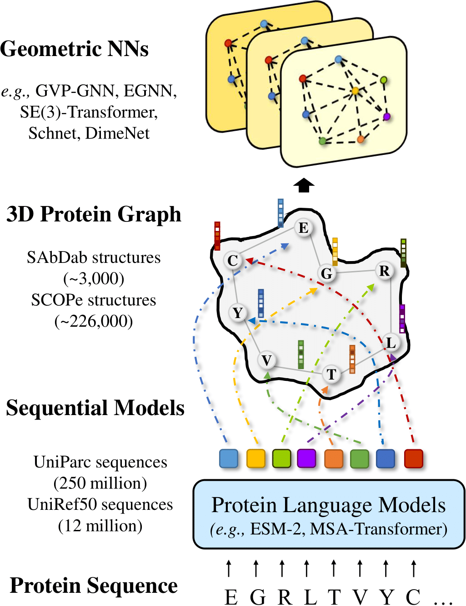

# When Geometric Deep Learning Meets Protein Language Models ☀️☀️☀️ 
 
This is the official implementation of paper ***When Geometric Deep Learning Meets Protein Language Models*** [[arxiv](https://arxiv.org/abs/2212.03447)].
Our work addresses the gap that has long been ignored by the geometric deep learning community for macromolecules. That is, few studies consider
incorporating different protein modalities to promote the representation capacity of geometric neural networks. To overcome this limitation, we 
propose a simple but effective approach to use the pretrained language models such as ESM [[1]](#1) and ProtTrans [[2]](#2) as the feature initializer for 
3D geometric networks such as EGNN and GVP-GNN. Extensive experiments in a variety of tasks demonstrate its efficacy and we hope to shed light on the future 
development of methods on the combination of 1D protein sequences and 3D protein structural data. 

<p align="center"></p>

## Environmental Setup
Before implementing the code, it is necessary to install some packages. 
```markdown
pip install torch    # we use torch 1.10.0 & cu113
pip install atom3d
pip install -U scikit-learn
pip install torch-cluster -f https://data.pyg.org/whl/torch-1.10.0+cu113.html
pip install torch-scatter -f https://data.pyg.org/whl/torch-1.10.0+cu113.html 
pip install torch-sparse -f https://data.pyg.org/whl/torch-1.10.0+cu113.html 
pip install torch-geometric
pip install fair-esm  
pip install pandas openpyxl   
```
The first time you use ESM, the pioneering protein language models, it will automatically download the pretrained checkpoint. 
Sometimes, this process can be roughly slow. A potential solution is to download the checkpoint weight manually from 
"https://dl.fbaipublicfiles.com/fair-esm/models/esm2_t33_650M_UR50D.pt" and then move it to the target file folder (*e.g.*, 
xxx/torch/hub/checkpoints/).


## Data Preparation and Different Downstream Tasks
Here we provide 5 tasks. Among them, the sequential position identification is the toy task to investigate the representation capacity of geometric 
graph neural networks. The model quality assessment is the **single-protein representation problem**. The protein-protein interface prediction and the 
protein-protein rigid-body docking are the **protein-protein representation problems**. The binding affinity prediction is the **protein-molecule representation 
problem**. 

### Sequential Position Identification 
We use the well-curated dataset provided by atom3d [[3]](#3). Download and unzip the data from this [link](https://zenodo.org/record/5026743#.Y56sonZBxD8).
Then put the file *split-by-cath-topology/xxx* under the folder *data/TOY/xxx*.

Run the following line to implement the sequential position identification task, where geometric models are required to predict the 
sequential orders of eac residue in the protein sequence. You can select the argument **model** from '*egnn*', '*gvp*' and '*molformer*' to 
test different architectures. You can also examine different mechanisms to build the graph connectivity, including '*knn*', '*rball*'. 
Also, tune **gpu** to different device numbers if you have multiple GPUs. 
```markdown
python main.py TOY --model=egnn  --connect=knn --gpu=0
```

### Modal Quality Assessment 
We use a well-constructed dataset offered by atom3d [[3]](#3). Download and unzip the data from this [link](https://zenodo.org/record/4915648#.Y56tVXZBxD8).
Then put the file *split-by-year/xxx* under the folder *data/PSR/xxx*.

Run the following line to implement the model quality assessment task. Here you can set the additional argument **plm=1** to equip the 
geometric graph neural networks with pretrained protein language models. 
```markdown
python main.py PSR --model=egnn --plm=1
```

### Protein-protein Interface Prediction
We use a well-built dataset offered by atom3d [[3]](#3). Download and unzip the data from this [link](https://zenodo.org/record/4911102).
Then put the file *DIPS-split/xxx* under the folder *data/PPI/xxx*.

Run the following line to implement the protein-protein interface prediction task.
```markdown
python main.py PPI --model=egnn --plm=1
```

### Protein-protein Rigid-body Docking
We use the original [code](https://github.com/octavian-ganea/equidock_public) from EquiDock [[4]](#4) and only change the input features, which is 
obtained from ESM-2. Notably, this task cannot be perfectly compiled with the implementation of other tasks since the backbone models are totally distinct.
However, the core idea are the same. We choose not to post the related code here for code consistency. If anyone finds difficulties in reproducing this task
with ESM's features, please full an issue. 


### Binding Affinity Prediction 
We use a widely-accepted dataset provided by atom3d [[3]](#3). Download and unzip the data from this [link](https://zenodo.org/record/4914718#.Y56xXXZBxD8).
Then put the file *split-by-sequence-identity-{lba_split}xxx* under the folder *data/LBA/xxx*.

Run the following line to implement the binding affinity prediction task. You can change the argument **lba-split** to 30 or 60 
for different sequence identity splits. 
```markdown
python main.py LBA --model=egnn --plm=1  --lba-split=30
```


## Cite and Contact
If you find this paper and the corresponding code interesting and helpful, 
we would really appreciate it if you can cite the paper. Thank you! 😜  
Moreover, we welcome any sort of relevant questions. Please do not hesitate to contact [Fang WU](mailto:fw2359@columbia.edu).
```markdown
@article{wu2022geometric,
  title={When Geometric Deep Learning Meets Pretrained Protein Language Models},
  author={Wu, Fang and Tao, Yu and Radev, Dragomir and Xu, Jinbo},
  journal={arXiv preprint arXiv:2212.03447},
  year={2022}
}
```

## Acknowledgement
We thank [Kevin K. Yang](https://scholar.google.com/citations?user=mq-Vzk8AAAAJ&hl=en) from Microsoft Research for his valuable advice and corrections.
We also want to thank [MoleculeMind](http://moleculemind.com/) for its GPU resources to run this project. 

## References
<a id="1">[1]</a> 
Lin, Zeming, et al. "Evolutionary-scale prediction of atomic level protein structure with a language model." bioRxiv (2022).      
<a id="2">[2]</a> 
Elnaggar, Ahmed, et al. "ProtTrans: towards cracking the language of Life's code through self-supervised deep learning and high performance computing." arXiv preprint arXiv:2007.06225 (2020).  
<a id="3">[3]</a> 
Townshend, Raphael JL, et al. "Atom3d: Tasks on molecules in three dimensions." arXiv preprint arXiv:2012.04035 (2020).    
<a id="4">[4]</a> 
Ganea, Octavian-Eugen, et al. "Independent se (3)-equivariant models for end-to-end rigid protein docking." arXiv preprint arXiv:2111.07786 (2021).

